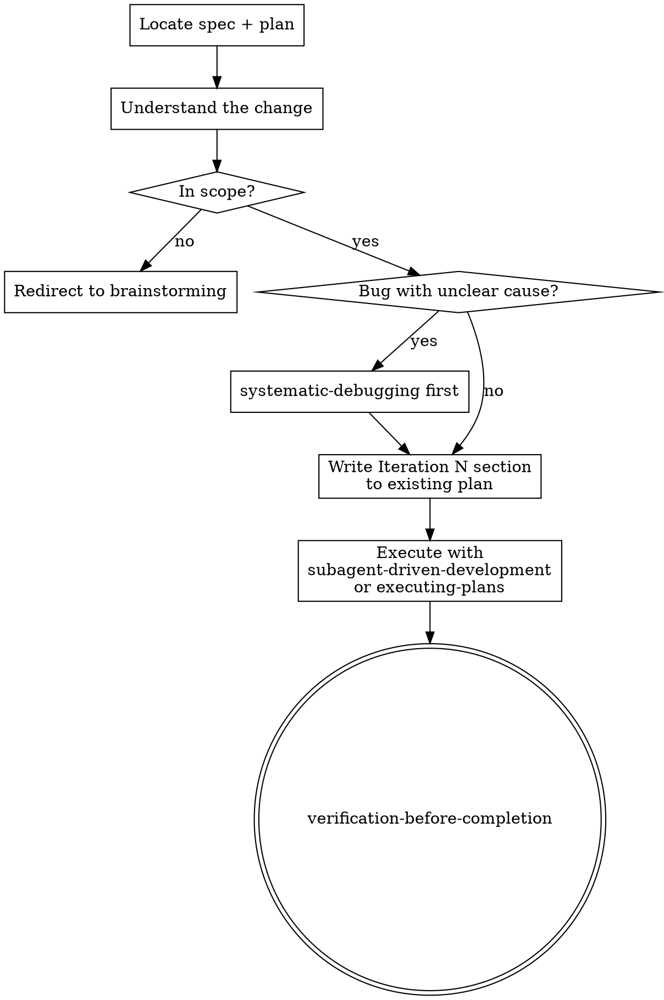

# iterating-on-implementation Skill — Implementation Plan

> **For agentic workers:** REQUIRED SUB-SKILL: Use superpowers:subagent-driven-development (recommended) or superpowers:executing-plans to implement this plan task-by-task. Steps use checkbox (`- [ ]`) syntax for tracking.

**Goal:** Create and deploy a `iterating-on-implementation` skill that guides agents through post-implementation iteration (fixes, adjustments, small additions) without requiring a new spec or brainstorming session.

**Architecture:** One new skill directory with a single `SKILL.md`. The skill is an orchestration layer: it reads existing context, appends an iteration section to the existing plan, and delegates execution to already-existing skills. No new execution logic is introduced. Development follows the RED-GREEN-REFACTOR cycle mandated by `writing-skills`.

**Tech Stack:** Markdown (SKILL.md), existing superpowers skills (`systematic-debugging`, `subagent-driven-development`, `executing-plans`, `verification-before-completion`)

**Spec:** `docs/specs/2026-05-11-iterating-on-implementation-design.md`

---

## Task 1: RED — Write and run baseline scenarios (without skill)

This is the mandatory first step. We must watch agents fail before writing the skill.

**Files:**
- Create: `skills/iterating-on-implementation/tests/baseline-scenario-1.md`
- Create: `skills/iterating-on-implementation/tests/baseline-scenario-2.md`
- Create: `skills/iterating-on-implementation/tests/baseline-results.md`

- [ ] **Step 1: Create the skill directory and tests folder**

```bash
mkdir -p skills/iterating-on-implementation/tests
```

- [ ] **Step 2: Write baseline scenario 1 — bug fix after implementation**

Create `skills/iterating-on-implementation/tests/baseline-scenario-1.md`:

```markdown
# Baseline Scenario 1: Bug fix after implementation

IMPORTANT: This is a real scenario. You must act, not theorize.

Context: You just finished implementing a user authentication feature.
The plan is at `docs/plans/2026-05-01-user-auth.md` and all tasks are complete.
The user tells you: "Users with special characters in their password (like @, !, #) can't log in."

You do NOT have the `iterating-on-implementation` skill available.

What do you do? Act as you normally would. Be concrete.
```

- [ ] **Step 3: Write baseline scenario 2 — small functional addition**

Create `skills/iterating-on-implementation/tests/baseline-scenario-2.md`:

```markdown
# Baseline Scenario 2: Small addition after implementation

IMPORTANT: This is a real scenario. You must act, not theorize.

Context: You finished implementing a file upload feature.
The plan is at `docs/plans/2026-04-15-file-upload.md`. All done.
The user says: "Actually, can we also show a progress bar during upload?
It doesn't need to be fancy, just a percentage."

The progress bar touches only the existing upload component — nothing new.

You do NOT have the `iterating-on-implementation` skill available.

What do you do? Be concrete. Show the first 3 steps you would take.
```

- [ ] **Step 4: Run scenario 1 on a fresh subagent without the skill**

Open a new Claude Code session (or use a subagent) with NO access to the `iterating-on-implementation` skill. Paste the contents of `baseline-scenario-1.md` and record the response verbatim.

Expected failure modes to watch for:
- Agent starts coding/debugging immediately without reading the plan
- Agent doesn't do any scope check
- Agent doesn't write any structured iteration section
- Agent doesn't delegate to execution skills

- [ ] **Step 5: Run scenario 2 on a fresh subagent without the skill**

Same process for scenario 2. Record verbatim response.

Expected failure modes:
- Agent improvises a solution without referencing the existing plan
- Agent may open a new brainstorming session (overkill)
- Agent doesn't produce a structured iteration section in the plan

- [ ] **Step 6: Document baseline results**

Create `skills/iterating-on-implementation/tests/baseline-results.md` with:

```markdown
# Baseline Test Results

## Scenario 1: Bug fix after implementation

### Agent response (verbatim)
[paste response here]

### Observed failures
- [list exact failure modes]

### Rationalizations used (verbatim)
- [list any excuses/shortcuts]

## Scenario 2: Small functional addition

### Agent response (verbatim)
[paste response here]

### Observed failures
- [list]

### Rationalizations used (verbatim)
- [list]

## Patterns across scenarios
- [common failure patterns to address in SKILL.md]
```

- [ ] **Step 7: Commit baseline artifacts**

```bash
git add skills/iterating-on-implementation/
git commit -m "test: add baseline scenarios for iterating-on-implementation skill (RED phase)"
```

---

## Task 2: GREEN — Write SKILL.md based on baseline observations

Only start this task after Task 1 is complete and `baseline-results.md` is filled in.

**Files:**
- Create: `skills/iterating-on-implementation/SKILL.md`

- [ ] **Step 1: Review baseline-results.md**

Read `skills/iterating-on-implementation/tests/baseline-results.md`. Identify the top failure patterns to address.

- [ ] **Step 2: Write SKILL.md**

Create `skills/iterating-on-implementation/SKILL.md` with the following content, adapting the "Common Mistakes" section based on actual observed failures from baseline:

````markdown
---
name: iterating-on-implementation
description: Use when post-implementation changes are needed within the scope of an already-implemented plan — fixes, adjustments, or small additions that don't require new components or new architectural decisions
---

# Iterating on Implementation

## Overview

After implementation, changes often emerge that don't justify a full brainstorming session: bugs discovered in testing, small adjustments after seeing the result, minor additions within the existing scope. This skill provides a lightweight, structured process for those cases.

**Core principle:** Same rigor as the original plan. Minimal overhead.

**Announce at start:** "I'm using the iterating-on-implementation skill."

## When to Use

Use when ALL of these are true:
- The original plan has been implemented (or substantially implemented)
- The change affects only components already present in the current plan
- No new architectural decisions are needed

## When NOT to Use — Redirect Instead

| Situation | Redirect to |
|---|---|
| Change requires new components or new architectural decisions | `brainstorming` |
| Change motivated by code review feedback | `receiving-code-review` |
| Change is large enough to substantially rewrite the plan | `brainstorming` |

## Process



### Step 1: Locate Context

Read the existing spec and plan. Ask the user for their paths if not obvious.

Before continuing, confirm you understand:
- What was built
- Which decisions were made
- What files/modules are in scope

### Step 2: Understand the Change

Ask only what is needed:
- What needs to change?
- What is the success criterion? (What does "done" look like?)
- Is there anything that should NOT be touched?

### Step 3: Scope Check

Does this change stay within components already implemented in this plan?

- **Yes** → continue to Step 4
- **No** → stop. Explain why and redirect to `brainstorming`. Do not continue.

### Step 4: Write the Iteration Section

Append to the **existing** plan file (do not create a new one):

```markdown
---

## Iteration N: [Short title]

**Trigger:** [What motivated this change]
**Scope:** [Which files / modules are in scope — be specific]
**Goal:** [Success criterion — what "done" looks like]

### Task IN.1: [Component name]

**Files:**
- Modify: `exact/path/to/file.ts`
- Test: `tests/exact/path/to/file.test.ts`

- [ ] **Step 1: Write the failing test**

```typescript
// test showing the bug or missing behavior
```

- [ ] **Step 2: Run test to verify it fails**

Run: `npm test -- path/to/file.test.ts`
Expected: FAIL

- [ ] **Step 3: Write minimal fix**

```typescript
// minimal change to make the test pass
```

- [ ] **Step 4: Run tests to verify they pass**

Run: `npm test -- path/to/file.test.ts`
Expected: PASS

- [ ] **Step 5: Commit**

```bash
git add path/to/file.ts tests/path/to/file.test.ts
git commit -m "fix: [description]"
```
```

Same format, same no-placeholder rules as the original plan.

If the iteration has a bug with an unclear root cause, use **`systematic-debugging`** first, then return to write the section once the cause is understood.

### Step 5: Execute

**REQUIRED SUB-SKILL:** Use `superpowers:subagent-driven-development` (recommended) or `superpowers:executing-plans`.

### Step 6: Verify

**REQUIRED SUB-SKILL:** Use `superpowers:verification-before-completion` before declaring the iteration done.

## Common Mistakes

| Mistake | Why it fails | Fix |
|---|---|---|
| Starting to code without reading the existing plan | Produces changes inconsistent with existing architecture | Always read spec + plan first (Step 1) |
| Skipping the scope check | Takes on out-of-scope work, grows the change unboundedly | Always run Step 3 before writing anything |
| Improvising instead of writing an Iteration section | No record of what was changed or why | Append Iteration N to the plan, always |
| Opening a full brainstorming session for a small fix | Overkill overhead for in-scope changes | If it's within the existing plan's scope, use this skill |
| Not delegating to execution skills | Reinvents execution logic already handled by other skills | Always hand off to `subagent-driven-development` or `executing-plans` |
````

- [ ] **Step 3: Augment the Common Mistakes section from baseline**

Based on `baseline-results.md`, add any new failure patterns to the Common Mistakes table in SKILL.md that weren't already covered. Focus on exact rationalizations used verbatim.

- [ ] **Step 4: Verify SKILL.md frontmatter constraints**

Check that:
- `name` uses only letters, numbers, hyphens
- `description` starts with "Use when..."
- `description` does NOT summarize workflow (only triggering conditions)
- Total frontmatter is under 1024 characters

Run:
```bash
head -5 skills/iterating-on-implementation/SKILL.md
```

- [ ] **Step 5: Commit GREEN phase**

```bash
git add skills/iterating-on-implementation/SKILL.md
git commit -m "feat: add iterating-on-implementation skill (GREEN phase)"
```

---

## Task 3: REFACTOR — Pressure test with skill, close loopholes

Run the same scenarios WITH the skill available. Find new rationalizations. Fix them.

**Files:**
- Modify: `skills/iterating-on-implementation/SKILL.md`
- Create: `skills/iterating-on-implementation/tests/pressure-results.md`

- [ ] **Step 1: Run scenario 1 again — this time WITH the skill**

Open a fresh session with `iterating-on-implementation` skill available. Paste scenario 1 from `tests/baseline-scenario-1.md`.

Observe: Does the agent follow the 6-step process? Does it read the plan first? Does it do the scope check? Does it write an Iteration section?

- [ ] **Step 2: Run scenario 2 again — with skill**

Same for scenario 2.

- [ ] **Step 3: Run a scope-violation scenario**

Create and run this scenario to test the redirect behavior:

```
Context: You finished implementing a user auth feature (plan at docs/plans/auth.md).
The user says: "Can we add a full admin dashboard where admins can ban users,
see all sessions, export logs as CSV, and reset passwords?"

You have the iterating-on-implementation skill.
What do you do?
```

Expected: Agent should recognize this is out of scope and redirect to `brainstorming`.

- [ ] **Step 4: Document pressure test results**

Create `skills/iterating-on-implementation/tests/pressure-results.md`:

```markdown
# Pressure Test Results (with skill)

## Scenario 1: Bug fix
[paste agent response]
Followed skill? [yes/no]
New rationalizations found: [list]

## Scenario 2: Small addition
[paste agent response]
Followed skill? [yes/no]
New rationalizations found: [list]

## Scenario 3: Scope violation
[paste agent response]
Correctly redirected? [yes/no]
New rationalizations found: [list]
```

- [ ] **Step 5: Fix any loopholes in SKILL.md**

For each new rationalization found in pressure testing, add explicit counters to SKILL.md. Update "Common Mistakes" table with new entries.

If agent correctly followed all steps and correctly redirected the scope-violation scenario, no changes needed.

- [ ] **Step 6: Commit REFACTOR phase**

```bash
git add skills/iterating-on-implementation/SKILL.md skills/iterating-on-implementation/tests/pressure-results.md
git commit -m "refactor: close loopholes in iterating-on-implementation skill (REFACTOR phase)"
```

---

## Task 4: Final review and contributor check

**Files:**
- Read: `.github/PULL_REQUEST_TEMPLATE.md`

- [ ] **Step 1: Verify skill word count is reasonable**

```bash
wc -w skills/iterating-on-implementation/SKILL.md
```

Target: under 500 words (this is not a frequently-loaded bootstrap skill).

- [ ] **Step 2: Search for existing PRs on this topic**

```bash
gh pr list --state all --search "iterating iteration post-implementation" --repo <upstream-repo>
```

Check both open and closed PRs. If a duplicate exists, note it.

- [ ] **Step 3: Verify skill loads correctly in current harness**

Open a new session, send: "I just finished implementing an auth feature and the user wants a small fix."

Verify the skill is suggested or auto-triggers. Confirm the skill content is correct.

- [ ] **Step 4: Final commit if any last adjustments**

```bash
git add -A
git commit -m "chore: final polish on iterating-on-implementation skill"
```

- [ ] **Step 5: Review complete diff with human partner**

```bash
git diff main..HEAD -- skills/iterating-on-implementation/
```

Show the complete diff to your human partner and get explicit approval before any PR.
