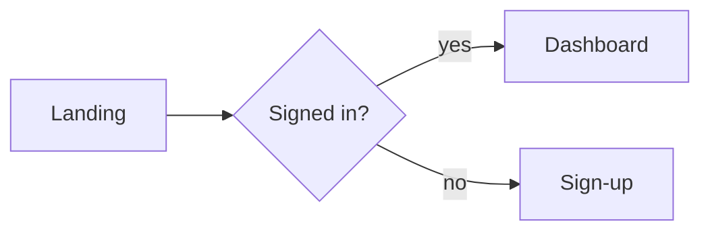

# Visual Companion Guide (Markdown-only)

Lightweight visual brainstorming using only Markdown artifacts — no server,
no scripts, no network. Visuals live as files the user previews in their
editor (VS Code, Obsidian, GitHub, etc.), or inline in the chat.

## Why Markdown-only

This skill intentionally ships with zero executables. All visual
capabilities are delivered through Markdown files and inline chat content.
This removes any attack surface (no local HTTP/WebSocket server, no
process management, no filesystem side-effects beyond the files you
explicitly create).

## When to Use Visual vs Terminal

Decide per-question. The test: **would the user understand this better by
seeing it than by reading it?**

**Use a visual artifact** when the content itself is visual:

- **UI mockups** — wireframes, layouts, navigation structures
- **Architecture diagrams** — components, data flow, relationships
- **Side-by-side comparisons** — two layouts, two flows, two approaches
- **Spatial relationships** — state machines, flowcharts, ER diagrams

**Use plain terminal text** when the content is textual or tabular:

- Requirements, scope, and clarifying questions
- Conceptual A/B/C choices described in words
- Tradeoff lists, pros/cons, comparison tables
- API/data-modeling decisions

A question *about* a UI topic is not automatically a visual question.
"What kind of wizard do you want?" is conceptual — use the terminal.
"Which of these wizard layouts feels right?" is visual — render a mockup.

## Offering the Companion

Same consent offer as before, but without any mention of local servers or
URLs:

> "Some of what we're working on might be easier to explain if I can show
> it to you as diagrams or mockups. I can put together Mermaid diagrams,
> ASCII wireframes, and side-by-side comparisons as Markdown files you
> preview in your editor. Want to try it?"

**This offer MUST be its own message.** Do not combine it with clarifying
questions or other content. Wait for the response. If declined, proceed
with text-only brainstorming.

## The Loop

1. **Create a Markdown artifact** for the current visual question:
   - Default location: `docs/brainstorm/<topic>.md`
     (or `.superpowers/brainstorm/<topic>.md` if the user prefers)
   - Use semantic filenames: `platform.md`, `visual-style.md`, `layout.md`
   - **Never reuse filenames** — iterate with suffixes like
     `layout-v2.md`, `layout-v3.md`
   - Add `.superpowers/` to `.gitignore` if you use that path and it is
     not already ignored

2. **Tell the user what to expect and end your turn:**
   - Point them at the file path
   - Give a brief text summary of what is in it (e.g., "Three layout
     options for the homepage — A, B, C")
   - Ask them to reply in the terminal with their choice or feedback
     (e.g., "Open it in your editor preview and let me know which one
     you prefer, or what you'd change.")

3. **On your next turn** — read the user's terminal reply as the primary
   feedback. There is no event stream; the user tells you what they
   picked.

4. **Iterate or advance** — if feedback changes the current artifact,
   write a new version file. Only move on when the current step is
   validated.

5. **Returning to terminal-only** — no cleanup needed. The Markdown
   files simply remain in the project as a record of the design
   conversation.

## Visual Building Blocks

### Mermaid diagrams (flowcharts, state, sequence, ER)

Most modern editors render Mermaid in Markdown preview. Use fenced blocks:

````markdown

````

Also available: `sequenceDiagram`, `stateDiagram-v2`, `classDiagram`,
`erDiagram`, `gantt`, `pie`.

### ASCII wireframes

Use fenced code blocks to lock whitespace:

````markdown
```text
+---------------------------------------------+
| LOGO        Home  Docs  Pricing     [Login] |
+---------------------------------------------+
| Hero headline                               |
| [ Call to action ]                          |
+---------------------------------------------+
| Feature A     | Feature B    | Feature C    |
+---------------------------------------------+
```
````

### Side-by-side comparisons

Use a two-column Markdown table where each cell holds a fenced block, or
two sibling fenced blocks under **Option A** / **Option B** headings.

```markdown
### Option A — Single column
```text
[ header ]
[ hero   ]
[ body   ]
[ footer ]
```

### Option B — Two column
```text
[ header        ]
[ nav | content ]
[ footer        ]
```
```

### Pros / Cons

```markdown
**Option A — Single column**

- Pros
  - Focused reading
  - Simple responsive behavior
- Cons
  - Less information density
```

### Options lists (A/B/C choices)

```markdown
## Which layout works better?

- **A. Single column** — clean, focused reading experience
- **B. Two column** — sidebar navigation with main content
- **C. Grid** — card-based, content-dense

Reply with the letter you prefer, or describe changes.
```

### Mockup container convention

Use a level-3 heading + fenced `text` block so previews render it as a
visually distinct "mockup":

````markdown
### Preview: Dashboard layout

```text
| Sidebar | Main ................... |
|  Home   |  Welcome back, user      |
|  Inbox  |  [ widget ] [ widget ]   |
|  Files  |  [ widget ] [ widget ]   |
```
````

## Design Tips

- **Scale fidelity to the question** — wireframes for layout decisions,
  real words and content for polish decisions
- **Explain the question on each artifact** — "Which layout feels more
  professional?" not just "Pick one"
- **Iterate before advancing** — new file per iteration
- **2–4 options max per artifact**
- **Keep mockups simple** — layout and structure, not pixel perfection

## File Naming

- Semantic names: `platform.md`, `visual-style.md`, `layout.md`
- Never reuse filenames — each artifact is a new file
- Iterations: `layout-v2.md`, `layout-v3.md`

## Cleaning Up

There is nothing to stop. The artifacts are just Markdown files. Keep
them as part of the project history, or delete them with a normal file
deletion if the user prefers.

## Security Notes

- No processes are started, no ports are opened, no sockets are created.
- All artifacts are plain text files under paths the agent explicitly
  writes to.
- The agent must never create or execute scripts as part of this skill.
  If a visual need cannot be met with Markdown + Mermaid + ASCII, fall
  back to terminal text rather than introducing executables.
