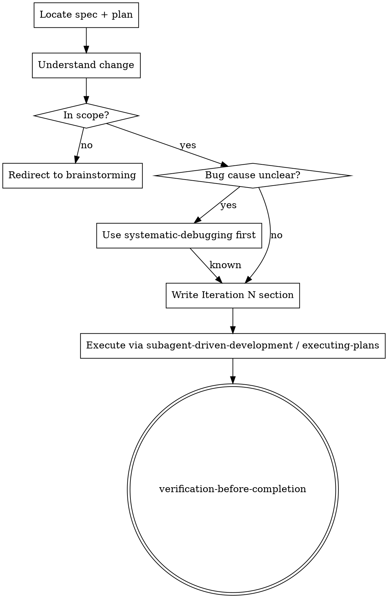

# Iterating on Implementation

## Overview

In-scope follow-ups extend the plan. **Core principle:** write an explicit iteration, then delegate execution.

**Announce at start:** "I'm using iterating-on-implementation for an in-scope iteration."

## When to Use

- Implemented work needs a fix or small addition.
- The change stays inside the current plan and components.

## When NOT to Use — Redirect Instead

| Situation | Redirect |
|---|---|
| New architecture, components, or product direction | `brainstorming` |
| Review feedback on existing implementation | `receiving-code-review` |
| In-scope change to existing work | **Do NOT run brainstorming for in-scope changes** |

## Process



1. Read the current spec and plan.
2. State the change and out-of-scope areas.
3. Scope check is mandatory: if scope expands, redirect to `brainstorming`.
4. For unclear bugs, use `systematic-debugging` first.
5. Append `Iteration N` to the plan.
6. Execute via `subagent-driven-development` or `executing-plans`, then use `verification-before-completion`.

## Iteration Section Format

````markdown
---

## Iteration N: [Short title]

**Trigger:** [What motivated this change]
**Scope:** [Which files / modules are in scope — be specific]
**Goal:** [Success criterion — what "done" looks like]

### Task IN.1: [Component name]

**Files:**
- Modify: `exact/path/to/file.ts`
- Test: `tests/exact/path/to/file.test.ts`

- [ ] **Step 1: Write the failing test**

```typescript
// test showing the bug or missing behavior
```

- [ ] **Step 2: Run test to verify it fails**

Run: `[test command]`
Expected: FAIL

- [ ] **Step 3: Write minimal fix**

```typescript
// minimal change to make the test pass
```

- [ ] **Step 4: Run tests**

Run: `[test command]`
Expected: PASS

- [ ] **Step 5: Commit**

```bash
git add [files]
git commit -m "fix: [description]"
```
````

## Common Mistakes

| Mistake | Correction |
|---|---|
| "Treat this as a new behavior change" | If it is still in scope, do not restart `brainstorming`. |
| Skipping the scope check entirely | Make scope explicit before proceeding. |
| Writing a vague follow-up plan/addendum | Append `## Iteration N` with Trigger, Scope, Goal, and steps. |
| Not delegating to execution skills | Hand execution to `subagent-driven-development` or `executing-plans`. |
