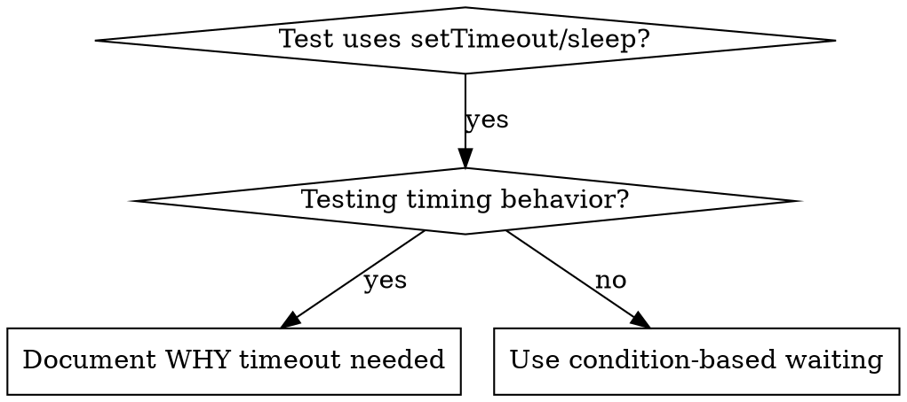

# Condition-Based Waiting

## Overview

Flaky tests often guess at timing with arbitrary delays. This creates race conditions where tests pass on fast machines but fail under load or in CI.

**Core principle:** Wait for the actual condition you care about, not a guess about how long it takes.

## When to Use



**Use when:**
- Tests have arbitrary delays (`setTimeout`, `sleep`, `time.sleep()`)
- Tests are flaky (pass sometimes, fail under load)
- Tests timeout when run in parallel
- Waiting for async operations to complete

**Don't use when:**
- Testing actual timing behavior (debounce, throttle intervals)
- Always document WHY if using arbitrary timeout

## Core Pattern

```typescript
// ❌ BEFORE: Guessing at timing
await new Promise(r => setTimeout(r, 50));
const result = getResult();
expect(result).toBeDefined();

// ✅ AFTER: Waiting for condition
await waitFor(() => getResult() !== undefined);
const result = getResult();
expect(result).toBeDefined();
```

## Quick Patterns

| Scenario | Pattern |
|----------|---------|
| Wait for event | `waitFor(() => events.find(e => e.type === 'DONE'))` |
| Wait for state | `waitFor(() => machine.state === 'ready')` |
| Wait for count | `waitFor(() => items.length >= 5)` |
| Wait for file | `waitFor(() => fs.existsSync(path))` |
| Complex condition | `waitFor(() => obj.ready && obj.value > 10)` |

## Implementation

Generic polling function:
```typescript
async function waitFor<T>(
  condition: () => T | undefined | null | false,
  description: string,
  timeoutMs = 5000
): Promise<T> {
  const startTime = Date.now();

  while (true) {
    const result = condition();
    if (result) return result;

    if (Date.now() - startTime > timeoutMs) {
      throw new Error(`Timeout waiting for ${description} after ${timeoutMs}ms`);
    }

    await new Promise(r => setTimeout(r, 10)); // Poll every 10ms
  }
}
```

### Domain-specific helpers (full implementation)

From a real debugging session (Lace test infrastructure, 2025-10-03) that
fixed 15 flaky tests by replacing arbitrary timeouts:

```typescript
// Complete implementation of condition-based waiting utilities
import type { ThreadManager } from '~/threads/thread-manager';
import type { LaceEvent, LaceEventType } from '~/threads/types';

/**
 * Wait for a specific event type to appear in thread.
 */
export function waitForEvent(
  threadManager: ThreadManager,
  threadId: string,
  eventType: LaceEventType,
  timeoutMs = 5000
): Promise<LaceEvent> {
  return new Promise((resolve, reject) => {
    const startTime = Date.now();
    const check = () => {
      const events = threadManager.getEvents(threadId);
      const event = events.find((e) => e.type === eventType);
      if (event) return resolve(event);
      if (Date.now() - startTime > timeoutMs) {
        return reject(new Error(`Timeout waiting for ${eventType} after ${timeoutMs}ms`));
      }
      setTimeout(check, 10);
    };
    check();
  });
}

/**
 * Wait for a specific number of events of a given type.
 */
export function waitForEventCount(
  threadManager: ThreadManager,
  threadId: string,
  eventType: LaceEventType,
  count: number,
  timeoutMs = 5000
): Promise<LaceEvent[]> {
  return new Promise((resolve, reject) => {
    const startTime = Date.now();
    const check = () => {
      const events = threadManager.getEvents(threadId);
      const matching = events.filter((e) => e.type === eventType);
      if (matching.length >= count) return resolve(matching);
      if (Date.now() - startTime > timeoutMs) {
        return reject(new Error(
          `Timeout waiting for ${count} ${eventType} events after ${timeoutMs}ms (got ${matching.length})`
        ));
      }
      setTimeout(check, 10);
    };
    check();
  });
}

/**
 * Wait for an event matching a custom predicate.
 */
export function waitForEventMatch(
  threadManager: ThreadManager,
  threadId: string,
  predicate: (event: LaceEvent) => boolean,
  description: string,
  timeoutMs = 5000
): Promise<LaceEvent> {
  return new Promise((resolve, reject) => {
    const startTime = Date.now();
    const check = () => {
      const events = threadManager.getEvents(threadId);
      const event = events.find(predicate);
      if (event) return resolve(event);
      if (Date.now() - startTime > timeoutMs) {
        return reject(new Error(`Timeout waiting for ${description} after ${timeoutMs}ms`));
      }
      setTimeout(check, 10);
    };
    check();
  });
}
```

**Before / after from the same session:**

```typescript
// BEFORE (flaky):
const messagePromise = agent.sendMessage('Execute tools');
await new Promise(r => setTimeout(r, 300)); // Hope tools start in 300ms
agent.abort();
await messagePromise;
await new Promise(r => setTimeout(r, 50));  // Hope results arrive in 50ms
expect(toolResults.length).toBe(2);         // Fails randomly

// AFTER (reliable):
const messagePromise = agent.sendMessage('Execute tools');
await waitForEventCount(threadManager, threadId, 'TOOL_CALL', 2);
agent.abort();
await messagePromise;
await waitForEventCount(threadManager, threadId, 'TOOL_RESULT', 2);
expect(toolResults.length).toBe(2);          // Always succeeds
```

Result: 60% pass rate → 100%, 40% faster execution.

## Common Mistakes

**❌ Polling too fast:** `setTimeout(check, 1)` - wastes CPU
**✅ Fix:** Poll every 10ms

**❌ No timeout:** Loop forever if condition never met
**✅ Fix:** Always include timeout with clear error

**❌ Stale data:** Cache state before loop
**✅ Fix:** Call getter inside loop for fresh data

## When Arbitrary Timeout IS Correct

```typescript
// Tool ticks every 100ms - need 2 ticks to verify partial output
await waitForEvent(manager, 'TOOL_STARTED'); // First: wait for condition
await new Promise(r => setTimeout(r, 200));   // Then: wait for timed behavior
// 200ms = 2 ticks at 100ms intervals - documented and justified
```

**Requirements:**
1. First wait for triggering condition
2. Based on known timing (not guessing)
3. Comment explaining WHY

## Real-World Impact

From debugging session (2025-10-03):
- Fixed 15 flaky tests across 3 files
- Pass rate: 60% → 100%
- Execution time: 40% faster
- No more race conditions
