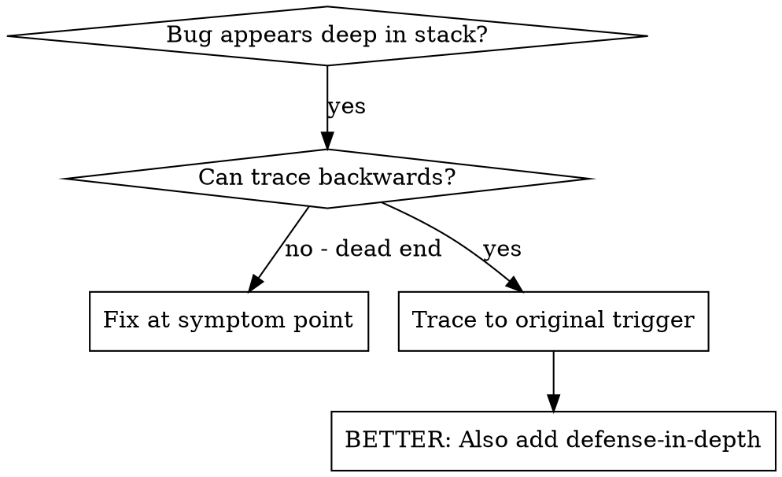
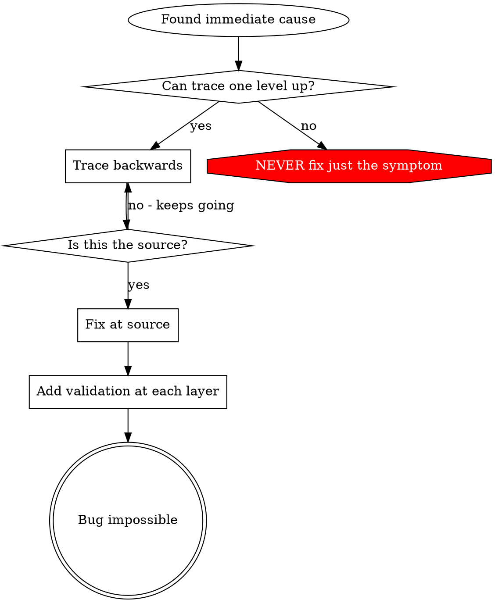

# Root Cause Tracing

## Overview

Bugs often manifest deep in the call stack (git init in wrong directory, file created in wrong location, database opened with wrong path). Your instinct is to fix where the error appears, but that's treating a symptom.

**Core principle:** Trace backward through the call chain until you find the original trigger, then fix at the source.

## When to Use



**Use when:**
- Error happens deep in execution (not at entry point)
- Stack trace shows long call chain
- Unclear where invalid data originated
- Need to find which test/code triggers the problem

## The Tracing Process

### 1. Observe the Symptom
```
Error: git init failed in /Users/jesse/project/packages/core
```

### 2. Find Immediate Cause
**What code directly causes this?**
```typescript
await execFileAsync('git', ['init'], { cwd: projectDir });
```

### 3. Ask: What Called This?
```typescript
WorktreeManager.createSessionWorktree(projectDir, sessionId)
  → called by Session.initializeWorkspace()
  → called by Session.create()
  → called by test at Project.create()
```

### 4. Keep Tracing Up
**What value was passed?**
- `projectDir = ''` (empty string!)
- Empty string as `cwd` resolves to `process.cwd()`
- That's the source code directory!

### 5. Find Original Trigger
**Where did empty string come from?**
```typescript
const context = setupCoreTest(); // Returns { tempDir: '' }
Project.create('name', context.tempDir); // Accessed before beforeEach!
```

## Adding Stack Traces

When you can't trace manually, add instrumentation:

```typescript
// Before the problematic operation
async function gitInit(directory: string) {
  const stack = new Error().stack;
  console.error('DEBUG git init:', {
    directory,
    cwd: process.cwd(),
    nodeEnv: process.env.NODE_ENV,
    stack,
  });

  await execFileAsync('git', ['init'], { cwd: directory });
}
```

**Critical:** Use `console.error()` in tests (not logger - may not show)

**Run and capture:**
```bash
npm test 2>&1 | grep 'DEBUG git init'
```

**Analyze stack traces:**
- Look for test file names
- Find the line number triggering the call
- Identify the pattern (same test? same parameter?)

## Finding Which Test Causes Pollution

If something appears during tests but you don't know which test, run tests one-by-one and check whether the pollution artifact appears after each one. This skill intentionally ships no executable scripts — copy the snippet below into a throwaway shell session (do not commit it to the repo), review it, then run it.

**Usage after you paste it into your own terminal:**

```bash
# Pass a real directory and a real filename glob. Do NOT use a shell glob
# like 'src/**/*.test.ts' as the pattern — find's -path is a literal path
# matcher, not a shell glob, and will silently match nothing.
find_polluter '.git' src tests -- '*.test.ts'
```

**Reference snippet (paste into your shell; do not add as a repo file):**

```bash
find_polluter() {
  # Usage: find_polluter <pollution_path> <search_dir> [<search_dir>...] -- <name_glob>
  #
  # pollution_path : file or dir whose appearance marks a polluting test
  # search_dir(s)  : directories to scan (DO NOT include node_modules)
  # name_glob      : filename glob after --, e.g. '*.test.ts'
  local pollution_check="$1"; shift || true
  local -a dirs=()
  while [ $# -gt 0 ] && [ "$1" != "--" ]; do
    dirs+=("$1"); shift
  done
  if [ "$1" != "--" ] || [ -z "$2" ] || [ -z "$pollution_check" ] || [ ${#dirs[@]} -eq 0 ]; then
    echo "Usage: find_polluter <pollution_path> <dir> [<dir>...] -- <name_glob>"
    return 1
  fi
  shift
  local name_glob="$1"

  echo "Searching for test that creates: $pollution_check"
  echo "Scanning: ${dirs[*]}  (glob: $name_glob)"

  # Safety: refuse to scan node_modules / vendor / .git, which can execute
  # arbitrary third-party code through their test files.
  local -a test_files=()
  while IFS= read -r -d '' f; do
    case "$f" in
      */node_modules/*|*/.git/*|*/vendor/*|*/dist/*|*/build/*) continue ;;
    esac
    test_files+=("$f")
  done < <(find "${dirs[@]}" -type f -name "$name_glob" -print0 | sort -z)

  local total=${#test_files[@]}
  echo "Found $total test files"

  local count=0
  for test_file in "${test_files[@]}"; do
    count=$((count + 1))

    if [ -e "$pollution_check" ]; then
      echo "Pollution already exists before test $count/$total — skipping $test_file"
      continue
    fi

    echo "[$count/$total] $test_file"
    npm test -- "$test_file" >/dev/null 2>&1 || true

    if [ -e "$pollution_check" ]; then
      echo "FOUND POLLUTER: $test_file created $pollution_check"
      ls -la "$pollution_check"
      return 0
    fi
  done

  echo "No polluter found"
  return 0
}
```

**Why not ship it as a script?** Executable files in a skill directory widen the attack surface (accidental execution, tampering, path-based injection). Keeping it as documented code the user pastes themselves keeps the skill to Markdown only. **Also:** never point the scanner at `node_modules/` or any vendored third-party source — running their test files executes their code.

## Real Example: Empty projectDir

**Symptom:** `.git` created in `packages/core/` (source code)

**Trace chain:**
1. `git init` runs in `process.cwd()` ← empty cwd parameter
2. WorktreeManager called with empty projectDir
3. Session.create() passed empty string
4. Test accessed `context.tempDir` before beforeEach
5. setupCoreTest() returns `{ tempDir: '' }` initially

**Root cause:** Top-level variable initialization accessing empty value

**Fix:** Made tempDir a getter that throws if accessed before beforeEach

**Also added defense-in-depth:**
- Layer 1: Project.create() validates directory
- Layer 2: WorkspaceManager validates not empty
- Layer 3: NODE_ENV guard refuses git init outside tmpdir
- Layer 4: Stack trace logging before git init

## Key Principle



**NEVER fix just where the error appears.** Trace back to find the original trigger.

## Stack Trace Tips

**In tests:** Use `console.error()` not logger - logger may be suppressed
**Before operation:** Log before the dangerous operation, not after it fails
**Include context:** Directory, cwd, environment variables, timestamps
**Capture stack:** `new Error().stack` shows complete call chain

## Real-World Impact

From debugging session (2025-10-03):
- Found root cause through 5-level trace
- Fixed at source (getter validation)
- Added 4 layers of defense
- 1847 tests passed, zero pollution
